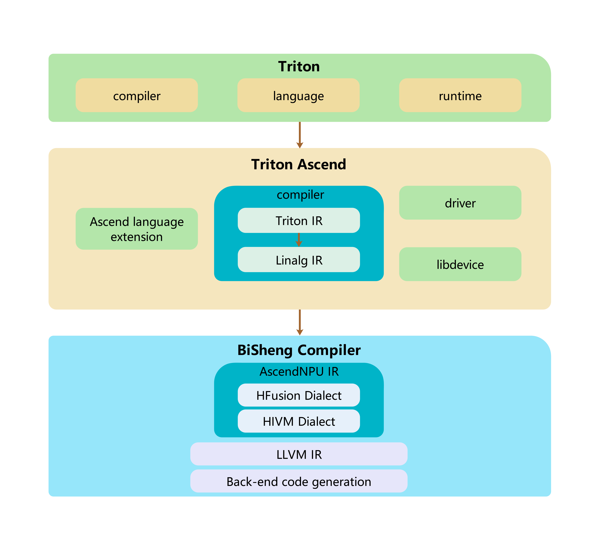

# Architecture Design and Core Features

## 1. Logical Architecture


**Triton-Ascend Architecture Description**

**Core Components:**

- **`Ascend language extension`**: Triton language extension adapted for Ascend
- **`compiler`**: Triton compiler adapted for Ascend
- **`driver`**: Device driver interface adapted for Ascend

**Component Functions:**

- **`Ascend language extension`**
  Introduces syntax and semantic extensions targeting the Ascend NPU architecture, based on the standard Triton language.

- **`compiler`**
  Receives the intermediate representation file `TTIR` (Triton IR) generated by the upper-level Triton compiler, and performs a series of transformations adapted for Ascend hardware.

  ```python
  Triton IR → Linalg IR → AscendNPU IR → triton_xxx_kernel.o
  ```

  Triton IR is converted to Linalg IR, and then the BiSheng Compiler generates the executable binary file `triton_xxx_kernel.o` for the Ascend NPU.

- **`driver`**
  Provides the interface between the Triton runtime and the Ascend software stack (CANN), loading the device-side executable kernel `triton_xxx_kernel.o` generated by the BiSheng Compiler.

## 2. Code Structure

### 2.1 Code Structure Principles

This project extends the standard Triton to support Huawei Ascend NPU (via the CANN software stack). The overall design follows the following **code principles**:

> - **If a modification is target independent**, it should remain in the **Triton core** part (e.g., general modifications to language, runtime);
> - **If a modification is strongly related to Ascend hardware** (target affinitive), it should be placed in **Triton-Ascend**.

### 2.2 Directory Structure and Function Description

| Directory or File | Corresponding Architecture Layer | Function Description |
| --- | --- | --- |
| `python/` | Triton core | Retains the standard Triton Python-side general implementation, including `triton.language`, JIT, runtime, caching, toolchain entry points, etc. General capabilities independent of hardware are prioritized in this directory. |
| `include/` and `lib/` | Triton core | Retains the standard Triton general C++/MLIR infrastructure, Dialects, Passes, and transformation logic. Ascend-specific backend implementations are not hosted here. |
| `third_party/ascend/` | Triton-Ascend | The root directory for the Ascend backend, centrally hosting language extensions, compilation backend, runtime driver, MLIR Passes, examples, and tests that are strongly related to Ascend NPU, CANN, and BiSheng Compiler. |
| `third_party/ascend/language/` | Ascend language extension | The Ascend language extension directory. After installation, it will be linked under `triton.language.extra`, allowing Triton kernels to use it via `triton.language.extra.cann`. |
| `third_party/ascend/language/cann/libdevice.py` | Ascend language extension | The `libdevice` Python interface adapted for Ascend NPU, providing math functions and low-level operator wrappers for Triton operators. |
| `third_party/ascend/backend/compiler.py` | compiler | The main entry point for the Ascend compiler backend, responsible for registering compilation options, orchestrating the transformation from TTIR to Ascend-adapted IR, Linalg/LLVM stages, and invoking the downstream toolchain to generate executable binaries. |
| `third_party/ascend/backend/driver.py` | driver | The Ascend runtime driver module, responsible for interfacing with the CANN/torch_npu runtime environment, loading and launching the compiled device-side executable file. |
| `third_party/ascend/include/` and `third_party/ascend/lib/` | compiler | Ascend-specific MLIR Dialects, Passes, and transformation implementations, such as `TritonToLinalg`, `TritonToStructured`, `DynamicCVPipeline`, `AutoBlockify`, etc. |
| `third_party/ascend/AscendNPU-IR/` | compiler | Contains Ascend NPU-related IR and BiSheng compilation chain adaptation content. It is an important part of the pipeline that continues from the Triton-Ascend compilation flow down to hardware-side code generation. |
| `third_party/ascend/tutorials/` and `third_party/ascend/unittest/` | Examples and Tests | Provides Triton examples, migration samples, Python unit tests, and MLIR transformation tests on the Ascend platform, used to verify the capabilities of the Ascend backend. |

## 3. Modules

### 3.1 Triton core Enhancement

#### 3.1.1 Language expansion

| No. | Operator Name | Description |
| :--- | :--------------------------------------------- | :--------------------------------- |
| 1    | `tl.insert_slice(full, src, offsets, sizes, strides)` | Inserts a tensor into another tensor according to the specified offsets, sizes, and strides parameters.<br>**Return value**: The target tensor.<br>**full**: The target tensor into which the source tensor will be inserted.<br>**src**: The source tensor.<br>**offsets**: The offsets on the target tensor (tuple of integers).<br>**sizes**: The sizes on the source tensor (tuple of integers).<br>**strides**: The strides on the target tensor (tuple of integers). |
| 2    | `tl.extract_slice(full, offsets, sizes, strides)` | Extracts a slice tensor from another tensor according to the specified offsets, sizes, and strides parameters.<br>**Return value**: The slice tensor.<br>**full**: The source tensor from which the slice is extracted.<br>**offsets**: The offsets on the source tensor (tuple of integers).<br>**sizes**: The sizes of the slice tensor (tuple of integers).<br>**strides**: The strides on the source tensor (tuple of integers). |
| 3    | `tl.get_element(source, offset)` | Reads a tensor with dimensions and returns a single element at the specified offset.<br>**source**: The source tensor.<br>**offset**: The offset of the element extraction position (tuple of integers). |

### 3.2 Triton-Ascend

#### 3.2.1 Compiler Options

| No. | NPUOptions | Hardware Platform | Purpose |
| --- | --------------------------------------------- | ---------- | ----- |
| 1   | multibuffer | NPU | Autotune Option: Enable or disable ping-pong pipeline. Enabled by default. |
| 2   | enable_auto_bind_sub_block | NPU | Autotune option (CV-fused kernels only): Enable or disable auto-binding of sub-blocks. |
| 3   | enable_hivm_auto_cv_balance | NPU | Autotune option (CV-fused kernels only): Enable or disable automatic CV balancing. |
| 4   | sync_solver | NPU | Autotune option (CV-fused kernels only): Enable or disable the synchronization solver. |
| 5   | unit_flag | NPU | Autotune option: Enable or disable the sync unit flag. |
| 6   | inject_barrier_all | NPU | Autotune option: Enable or disable automatic injection of barriers for all operations. |
| 7   | inject_block_all | NPU | Autotune option: Enable or disable automatic injection of blocks for all operations. |
| 8   | limit_auto_multi_buffer_only_for_local_buffer | NPU | Autotune option: Restrict automatic multi-buffering only to local buffers. |
| 9   | limit_auto_multi_buffer_of_local_buffer | NPU | Autotune option: Enable or disable automatic multi-buffering for local buffers. |
| 10  | set_workspace_multibuffer | NPU | Autotune option: Enable or disable multi-buffering for the workspace. |
| 11  | tile_mix_vector_loop | NPU | Autotune option (CV-fused kernels only): Enable or disable tiling for vector loops. |
| 12  | tile_mix_cube_loop | NPU | Autotune option (CV-fused kernels only): Enable or disable tiling for cube loops. |
| 13  | disable_auto_inject_block_sync | NPU | Autotune option (CV-fused kernels only): Enable or disable automatic injection of block synchronizations. |
| 14  | stream | NPU | Optional: Inform the compiler about the NPU stream to use. |
| 15  | enable_linearize | NPU | Autotune option: Enable or disable the linearization pass. |
| 16  | enable_nd2nz_on_vector | NPU | Autotune option (CV-fused kernels only): Enable or disable the ND (n-dimensional) to NZ (non-zero) layout transformation. |
| 17  | auto_blockify_size | NPU | Autotune option: Enable or disable AutoBlockify pass. It is ignored when TRITON_ALL_BLOCKS_PARALLEL is not set |

#### 3.2.2 SIMD compiler

| No. | Pass | Purpose | IR Transformation |
| ------ | ---------------------- |----------------------------------------------------------------------| ----------------------- |
| 1      | triton-to-structured | linearize | ttir->ttir |
| 2      | triton-to-unstructured | convert indirect axis to loop | ttir->ttir |
| 3      | triton-to-linalg | memory/reduction/view/creation/math/arith/linear algebra to linalgir | ttir->linalgir |
| 4      | triton-to-other | ttir->hivm/hfusion/llvm | ttir->hivm/hfusion/llvm |

##### 3.2.2.1 TritonToStructured

Handles integer division and remainder operations in pointer expressions and mask expressions. By using a dimension-raising method, it removes integer division and remainder operations and regenerates operations like load/store.

| Converter | Function | Limitations |
| ------------------------ | -------------------------- | ------------------------- |
| RewriteAddPtrOp | Analyzes pointer expressions (`AddPtrOp`) in operations like `tl.load`, `tl.store`. Decomposes the original pointer offset calculation and models it as a `PtrState` object containing specific offset information for each dimension (axis). For example, for an expression like `ptr + x // 1024 * 4096 + x % 1024 * 4 + y`, it analyzes the contributions and relationships of the `x` and `y` axes. | 1. The original iteration axis (e.g., `x`) must be divisible by the split axis (e.g., `1024`).<br>2. The outer `XBLOCK` size must be an integer multiple or divisor of the split axis `divisor`. |
| CreateAddpr | Based on the analyzed `PtrState` object, reconstructs a new `AddPtrOp` pointer calculation operation. The newly generated pointer expression will eliminate the integer division (`//`) and modulo (`%`) operations from the original expression. | Depends on a valid `PtrState` successfully generated by `RewriteAddPtrOp`. |
| RewriteLoadOp | Analyzes the mask expression in `tl.load` operations. Decomposes complex mask conditions containing integer division/remainder and models them as a `MaskState` object containing boundary information for each dimension. For example, for `mask = x // 1024 < 8 and x % 1024 < 1024 and y < 4`, it analyzes the independent constraint conditions for each dimension. | 1. The original iteration axis (e.g., `x`) must be divisible by the split axis (e.g., `1024`).<br>2. The outer `XBLOCK` size must be an integer multiple or divisor of the split axis `divisor`. |
| BuildMask | Based on the analyzed `MaskState` object, reconstructs a new mask expression. The new mask will eliminate the integer division (`//`) and modulo (`%`) operations from the original expression. | Only handles `MaskState` generated by `RewriteLoadOp` or `RewriteStoreOp`. Cannot handle arbitrarily complex, non-standardized mask expressions. |
| CreateLoad | Uses the new pointer expression generated by `CreateAddpr` and the new mask expression generated by `BuildMask` to recreate (replace) the original `tl.load` operation, completing the instruction rewrite. | Depends on the successful execution of preceding steps like `RewriteAddPtrOp`, `CreateAddpr`, `RewriteLoadOp`, `BuildMask`. |
| RewriteStoreOp | Analyzes the mask expression in `tl.store` operations. Its function is similar to `RewriteLoadOp`, decomposing complex mask conditions containing integer division/remainder and modeling them as a `MaskState` object. | Same as `RewriteLoadOp`. |
| CreateStore | Uses the new pointer expression generated by `CreateAddpr` and the new mask expression generated by `BuildMask` to recreate (replace) the original `tl.store` operation, completing the instruction rewrite. | Depends on the successful execution of preceding steps like `RewriteAddPtrOp`, `CreateAddpr`, `RewriteStoreOp`, `BuildMask`. |
| RewriteAtomicRWMOp | Handles pointer issues in atomic read-write-modify operations (e.g., `atomic.add`, `atomic.max`). | Generally inherits the same limitations as `RewriteAddPtrOp`. May not support certain special, non-contiguous, or conditional atomic operation patterns. |
| RewriteAtomicCASOp | Handles the pointer linearization problem in atomic compare-and-swap operations (`atomic.cas`). Analyzes its pointer expression, eliminating integer division and remainder operations through dimension raising to match the addressing requirements of hardware atomic instructions. | |
| RewriteWhile | Handles pointer accumulation operations within `while` loop bodies. | Does not support complex pointer path transformations involving conditional branches (`if`) within the loop body. |
| RewriteFor | Handles pointer accumulation operations within `for` loop bodies. | |

##### 3.2.2.2 TritonToUnstructured

| No. | Pass / Converter | Description |
|------|-------------------------------------------|-----------------------------------------------------------------------------------------------------------------------------------------------------------------------|
| 1    | discrete-mask-access-conversion | Analyzes and transforms memory access patterns based on discrete index masks (Discrete Mask) in Triton (e.g., `triton.language.load` with a non-contiguous mask), preparing for the subsequent expansion of discrete axes into loops. This pass identifies irregular or sparse access patterns that cannot be efficiently handled by the backend hardware. |
| 2    | triton-to-unstructured | Converts tensor operations containing discrete axes (Discrete Axes), identified by `discrete-mask-access-conversion`, into scalar memory accesses based on explicit scalar loops. |
| 3    | bubble-up-operation | Mainly performs an upward movement optimization for `extract op/extract_slice` operations. This can optimize data locality and, in some scenarios, eliminate unnecessary loops generated after the transformation, thereby improving the execution efficiency of the generated code. |

###### 3.2.2.2.1 discrete-mask-access-conversion

| Converter Name | Description|
|----------------------------|--------------------------------------------------------------------------------------------------------------------------------------------------------------------------------------------------------|
| DiscreteMaskStoreConversion | First performs mask analysis. If the mask analysis result is non-contiguous, it transforms the original store operation into the following sequence:<br>1. load (load the content of the target storage address)<br>2. select (select between the target storage content and the value to be stored based on the mask)<br>3. store (store the result of the select back to the target address) |
| DiscreteMaskLoadConversion | First performs mask analysis. If the mask analysis result is non-contiguous, it transforms the original load operation into the following sequence:<br>1. load (load all content of the source tensor)<br>2. select (select the source tensor content based on the mask, setting the masked-out parts to the `other` value) |
| DiscreteMaskAtomicAddConversion | First performs mask analysis. If the mask analysis result is non-contiguous, it transforms the original atomic_add operation into the following sequence:<br>1. select (select the value based on the mask, setting the masked-out parts to 0)<br>2. atomic_add (use the result of the select to regenerate the atomic_add operation) |

###### 3.2.2.2.2 triton-to-unstructured

| TritonToUnstructured Converters | Description |
|---|---|
| UnstructuredMemAccessConverter\<triton::LoadOp\> | Converts LoadOp into multi-loop scalar loads |
| UnstructuredMemAccessConverter\<triton::StoreOp\> | Converts StoreOp into multi-loop scalar stores |
| UnstructuredMemAccessConverter\<triton::AtomicRMWOp\> | Converts AtomicRMWOp into multi-loop scalar Atomic operations |
| UnstructuredMemAccessConverter\<triton::AtomicCASOp\> | Converts AtomicCASOp into multi-loop scalar Atomic operations |

###### 3.2.2.2.3 bubble-up-operation

| Converter Name | Description |
|---|---|
| BubbleUpExtract\<tensor::ExtractOp\> | Upward movement optimization for extract op, can avoid generating unnecessary loops in certain scenarios |
| BubbleUpExtract\<tensor::ExtractSliceOp\> | Upward movement optimization for extract op/extract_slice, can avoid generating unnecessary loops in certain scenarios |

##### 3.2.2.3 TritonToLinalg

###### 3.2.2.3.1 triton-to-linalg

TritonToLinalg converts ttir to linalg ir.

| Converter | Description |
| ------------------------------------------ | ------------------------------------------------------------ |
| StoreConverter | triton::StoreOp to memref::copy |
| AddPtrConverter | triton::AddPtrOp to memref::ReinterpretCastOp |
| GetProgramIDConverter | triton::GetProgramIdOp to a param in functionOp |
| GetNumProgramsConverter | triton::GetNumProgramsOp to a param in functionOp |
| LoadConverter | triton::LoadOp to memref::copy and bufferization::ToTensorOp |
| AtomicRMWConverter | triton::AtomicRMWOp to linalg::GenericOp |
| AtomicCASConverter | triton::AtomicCASOp to linalg::GenericOp |
| MakeRangeConverter | triton::MakeRangeOp to linalg::GenericOp |
| SplatConverter | triton::SplatOp to linalg::FillOp |
| ClampFConverter | triton::ClampFOp to tensor::EmptyOp, linalg::FillOp |
| PreciseDivConverter | triton::PreciseDivFOp to arith::DivFOp |
| ArgMinConverter | triton::ArgMinOp to linalg::ReduceOp |
| ArgMaxConverter | triton::ArgMaxOp to linalg::ReduceOp |
| ReduceConverter | triton::ReduceOp to linalg::ReduceOp |
| ScanConverter | triton::ScanOp to func::CallOp |
| ReshapeConverter | triton::ReshapeOp to tensor::ReshapeOp |
| ExpandDimsConverter | triton::ExpandDimsOp to tensor::ExpandShapeOp |
| BroadcastConverter | triton::BroadcastOp to linalg::BroadcastOp |
| DenseConstantConverter | arith::ConstantOp to linalg::FillOp |
| ExternElementwiseClOpConverter | triton::ExternElementwiseOp to linalg::MapOp |
| TritonMulhiuiConverter | triton::MulhiUIOp to arith::MulSIExtendedOp |
| TritonPreciseSqrtConverter | triton::PreciseSqrtOp to math::SqrtOp |
| AdvanceConverter | triton::AdvanceOp to memref::ReinterpretCastOp |
| TransposeConverter | triton::TransOp to linalg::TransposeOp |
| SplitConverter | triton::SplitOp to tensor::ExtractSliceOp |
| JoinConverter | triton::JoinOp to tensor::InsertSliceOp |
| CatConverter | triton::CatOp to tensor::InsertSliceOp |
| BitcastConverter | triton::BitcastOp to arith::BitcastOp |
| LoopConverter\<scf::ForOp\> | scf::ForOp to scf::ForOp |
| LoopConverter\<scf::WhileOp\> | scf::WhileOp to scf::WhileOp |
| YieldConverter | scf::YieldOp to scf::YieldOp |
| GatherConverter | triton::GatherOp to func::FuncOp |
| GatherLoadConverter | triton::GatherLoadOp to scf::ForOp |
| DeviceAssertConverter | triton::AssertOp to func::FuncOp |
| DevicePrintConverter | triton::PrintOp to func::FuncOp |
| MatmulConverter | triton::DotOp to linalg::MatmulOp |
| SortOpConverter | triton::SortOp to func::FuncOp |
| DotScaledConverter | triton::DotScaledOp to linalg::MatmulOp |
| PtrToIntConverter | triton::PtrToIntOp |
| MakeTensorPtrConverter | triton::PtrToIntOp to arith::IndexCastOp |

##### 3.2.2.4 other passes

| Pass Name | Function Description | Core Converter | Converter Description |
|---|---|---|---|
| triton-to-annotation | Processes Ascend NPU-specific compilation hint instructions (`tl.compile_hint`), converting them into the backend's Annotation dialect, used to guide subsequent hardware-specific optimizations or resource configurations. | TritonAnnotationConversion | Converts `triton::AnnotationOp` to `annotation::MarkOp`, enabling the transfer of high-level compilation hint information to low-level annotation markers. |
| triton-to-hfusion | Converts `TTIR` in Triton to corresponding operations in the Ascend NPU hardware accelerator `HFusion` dialect. | TritonHistogramToHFusionConversion | Converts `triton::HistogramOp` to `hfusion::HistogramOp`, enabling efficient execution on dedicated NPU hardware. |
| triton-to-hivm | Handles Triton's block synchronization operations (`tl.sync_block_all`, `tl.sync_block_set`, `tl.sync_block_wait`), converting them into cross-core synchronization instructions in the Ascend NPU `HIVM` dialect. These instructions manage synchronization and data dependencies in multi-core pipelines and are key to pipeline optimization. | TritonCustomOpToHIVMSyncOpConversion | Implements the conversion of Triton synchronization instructions to HIVM synchronization instructions:<br>• `sync_block_all`: Global block synchronization<br>• `sync_block_set`: Set synchronization point<br>• `sync_block_wait`: Wait for synchronization point |
| triton-to-llvm | Converts Triton's inline assembly operations (`tl.inline_assembly`) to LLVM dialect inline assembly, and ultimately maps them to Ascend NPU's CCE hardware intrinsic functions (Intrinsics). | ElementwiseInlineAsmOpConversion | Converts `triton::ElementwiseInlineAsmOp` to `LLVM::InlineAsmOp` |

#### 3.2.3 Ascend affinitive Operators

| No. | Operator | Function Description |
|---|---|---|
| 1 | tl.custom_op | A set of custom operators extended for Ascend NPU, used to support hardware-specific memory access and data movement patterns, such as:<br>• `index_select`: Select data based on indices<br>• `index_put`: Place data based on indices<br>• `gather_out_to_ub`: Gather external data to Unified Buffer (UB)<br>• `scatter_ub_to_out`: Scatter data from UB to output<br>• `indirect_load`: Indirect address load<br>• `indirect_store`: Indirect address store |
| 2 | tl.compile_hint | Passes hardware-specific compilation hint information to the compiler, used to guide backend optimization strategies, resource allocation, or kernel configuration. |
| 3 | tl.sync_block_wait(`sender, receiver, event_id`) | Block synchronization wait operation. Specifies that the receiving core (`receiver`) waits for an event signal (`event_id`) sent by the sending core (`sender`), used to manage data dependencies and execution order in cross-core pipelines. |
| 4 | tl.sync_block_set(`sender, receiver, event_id`) | Block synchronization set operation. Specifies that the sending core (`sender`) sends an event signal (`event_id`) to the receiving core (`receiver`), indicating that a certain execution phase or data is ready. |
| 5 | tl.sync_block_all(`mode, event_id`) | Global block synchronization operation. Broadcasts an event signal (`event_id`) to all relevant receiving cores according to the specified synchronization mode (`mode`), used to achieve full-core synchronization or collective synchronization of a specific mode. |